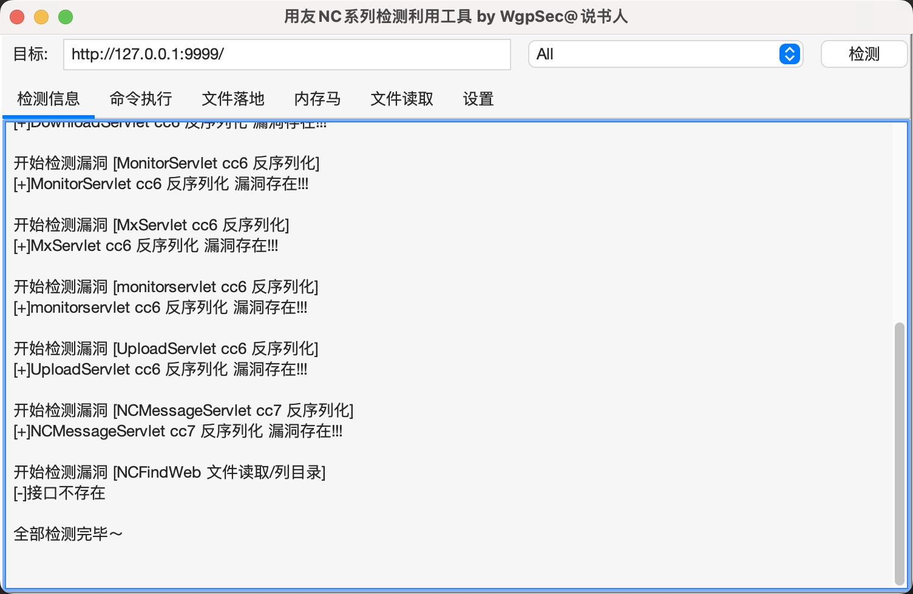
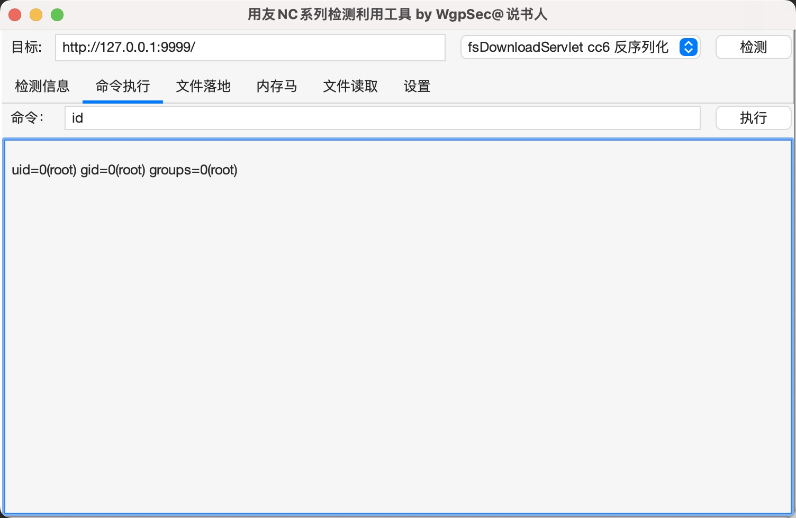
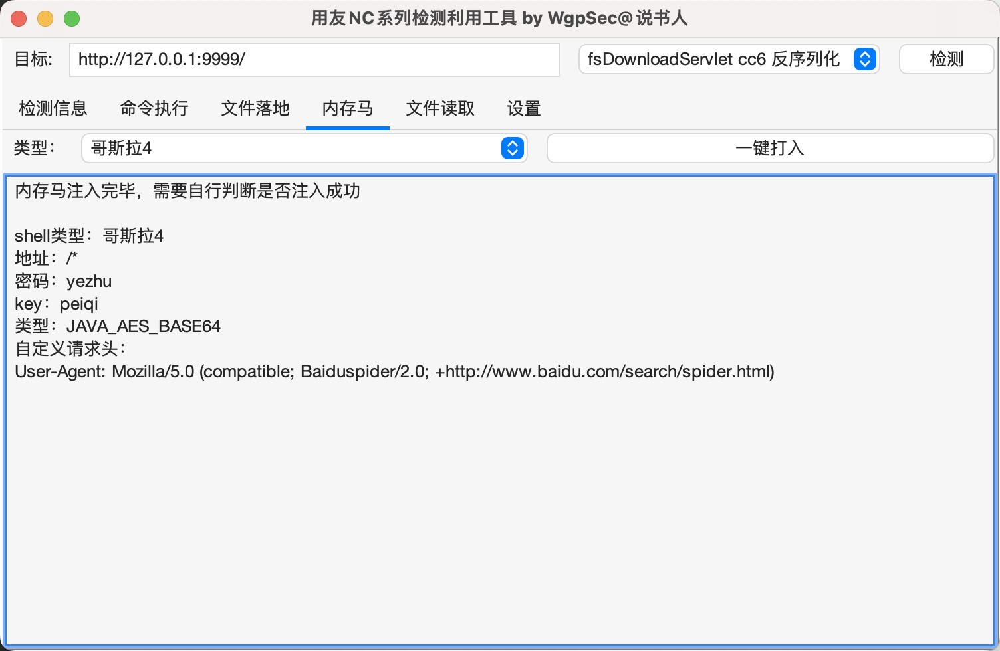
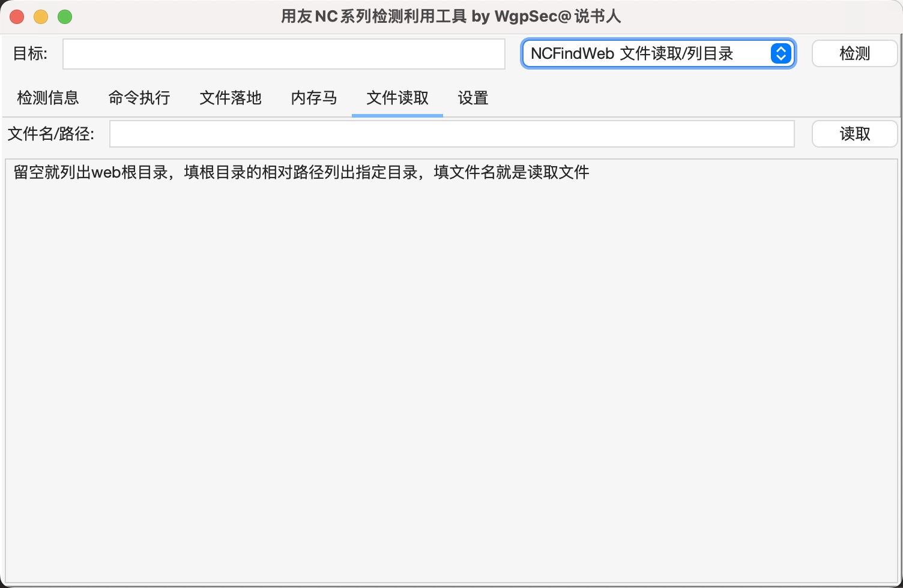
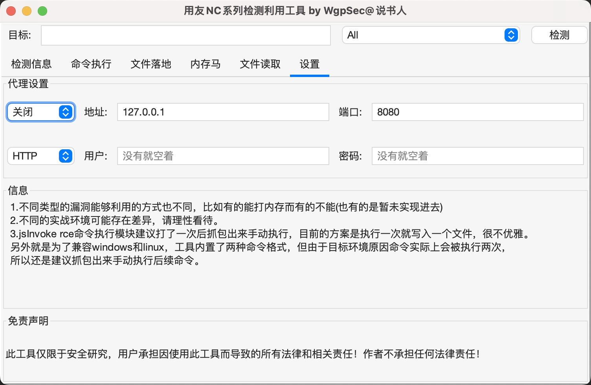

# 用友NC系列漏洞检测利用工具

  

用友NC系列漏洞检测利用工具，支持一键检测、命令执行回显、文件落地、一键打入内存马、文件读取等

> 免责声明：此工具仅限于安全研究，用户承担因使用此工具而导致的所有法律和相关责任！作者不承担任何法律责任！

## 🕳️ 目前已集成
* BshServlet rce
* jsInvoke rce
* DeleteServlet cc6 反序列化
* DownloadServlet cc6 反序列化
* FileReceiveServlet cc6 反序列化
* fsDownloadServlet cc6 反序列化
* MonitorServlet cc6 反序列化
* MxServlet cc6 反序列化
* monitorservlet cc6 反序列化
* UploadServlet cc6 反序列化
* NCMessageServlet cc7 反序列化
* NCFindWeb 文件读取/列目录

## ✨ 功能
###  一键检测

###  命令执行回显

###  文件落地

###  一键打入内存马

###  文件读取/目录浏览

###  http/socks5代理

## ⚠️说明
* 不同类型的漏洞能够利用的方式也不同，比如有的能打内存而有的不能(也有的是暂未实现进去)
* 不同的实战环境可能存在差异，请理性看待。
* jsInvoke rce命令执行模块建议打了一次后抓包出来手动执行，目前的方案是执行一次就写入一个文件，很不优雅。另外就是为了兼容windows和linux，工具内置了两种命令格式，但由于目标环境原因命令实际上会被执行两次，所以还是建议抓包出来手动执行后续命令。

## 🤝共建
很多点还需要完善，欢迎各位提issues、pull
* suo5一键打内存马，通过cc链直接打一直没测试成功
* 还有部分已知nday还没集成进去

## 交流

